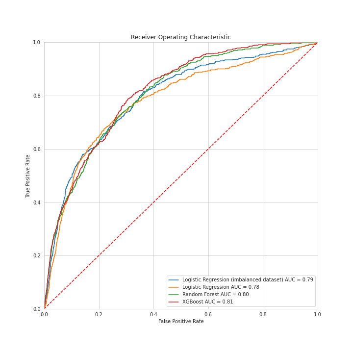

# Santander-Customer-Satisfaction

In this project, you'll work with hundreds of anonymized features to predict if a customer is satisfied or dissatisfied with their banking experience. You are provided with a dataset containing a large number of numeric variables. The task is to predict the probability of each customer in the test set being unsatisfied. 
Tools - Sklearn, Logistic Regression, XGBoost, Permutation Importance, SMOTE

## Results

